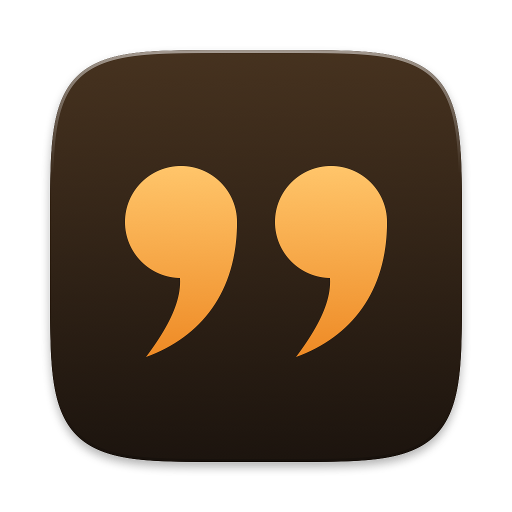

<p align="center">
  
</p>

# Quoth

**Local voice transcription on your Mac.**

Hold `fn`, speak, release, and your words appear at the cursor. For longer dictation, double-tap `fn` to lock recording on, and tap again when you're done. Everything runs on-device.

Quoth is based on [Parrot](https://github.com/humanitas-labs/parrot) by Humanitas Labs (MIT), with a hands-free lock added.

Website: [victorshammas.com/quoth](https://victorshammas.com/quoth/).

## 1. Install

Quoth comes in two editions from this one codebase ([ADR-006](docs/decisions/006-two-editions.md)):

- **Mac App Store**, $1.99, sandboxed. Pastes at the cursor once you allow it; otherwise each dictation is copied for ⌘V.
- **Free and open source**, this repository. It also reads the text field it types into, for exact spacing and to keep out of password fields, and has the `quoth` command. Build it from source (section 6) until there is a release.

Requires macOS 14+ on Apple silicon. Open Quoth and allow it when macOS asks for the microphone and Accessibility (Input Monitoring in the App Store edition). The first start downloads the speech model (about 150 MB).

## 2. Usage

1. Click into any text field.
2. **Hold `fn` and speak.** A small pill at the bottom of the screen shows the mic is live. On a keyboard where `fn` does nothing (Logitech and most third-party keyboards), choose another key under **Hotkey** in **Settings…**: left or right Option, Command, Control, or Shift.
3. Release. The transcript is pasted at the cursor and your clipboard is restored.

**Hands-free:** double-tap the hotkey to lock recording on. The pill shows a lock. Tap the hotkey again to stop and transcribe. A lock never throws your words away: a shortcut typed on the hotkey, changing the hotkey, or switching microphones ends it and transcribes what you said. While locked, text appears at the cursor at each pause in your speech, so a long dictation builds up as you talk and finishes almost at once. If you click into another window mid-dictation, the pill says so and the rest goes to the clipboard instead. A locked recording stops by itself after 10 minutes. Turn these off with **Double-tap to lock** and **Live text while locked** in Settings.

If the hotkey is `fn`, set **System Settings → Keyboard → Dictation → Shortcut** to Off, since macOS also uses a double press of `fn` to start its own dictation.

**Quote Card:** choose **Hands-free goes to › Quote Card** in Settings, or **New Quote Card** in the menu, and dictation streams into a small floating card instead, where you can edit it before **⌘↩** inserts it where you were. While the card is open, every dictation goes into it. The App Store edition uses it whenever it can't paste.

**Voice commands** (English): "new paragraph", "new line", "bullet point", "comma", "question mark", "quote … unquote", and "scratch that" to remove what was just typed. Settings › General lists them all. If Quoth misspells a word, **Fix Last Dictation…** in the menu teaches it; **Settings › Dictionary** lists your words.

Choose **Open at login** in **Settings…** to start Quoth with your Mac. A tap shorter than 0.3 s, or a hold with another modifier, is ignored, so shortcuts on the hotkey still work. If `fn` is mapped to input source or emoji, `quoth doctor` shows how to fix it.

To dictate in another language, choose a multilingual model in Settings (⌘, from the menu), then either one Language or Automatic. Automatic detects which of the languages under **Languages** each dictation is in, and never picks one you haven't listed. The list starts as your Mac's languages.

## 3. Dictionary

Add your names and technical terms to `~/.config/quoth/dictionary`, a plain-text table of each word and what the model writes instead, and Quoth spells them your way. **Open Dictionary File** in Settings opens it. Edits apply on the next dictation. See [docs/dictionary.md](docs/dictionary.md).

## 4. CLI

| Command | What it does |
|---|---|
| `quoth` | Run in the foreground (^C to quit) |
| `quoth setup` | One-time setup: permissions and model download |
| `quoth doctor` | Check permissions, and the `fn` key setting when the hotkey is `fn` |
| `quoth install --launch-at-login` | Start Quoth at login |
| `quoth install --cli` | Link `/usr/local/bin/quoth` to Quoth.app |
| `quoth install --uninstall` | Stop launching at login and remove logs |
| `quoth models list` | List available models, and which are on this Mac |
| `quoth models download <id>` | Download a model |
| `quoth models remove <id>` | Delete a downloaded model |
| `quoth --model whisper-large-v3-turbo` | Larger, multilingual model |
| `quoth --hotkey right-option` | Use another key for this run only; Settings… changes the saved key |
| `quoth --no-overlay` | Hide the recording pill |
| `quoth --inject-mode type-unicode` | Type instead of paste (leaves the clipboard alone) |

## 5. How it works

WhisperKit runs Whisper on the Apple Neural Engine via CoreML, a Core Audio input unit captures the mic, a CGEventTap watches the hotkey, and a synthesized ⌘V pastes the result. Nothing leaves your Mac, and logs never contain what you said. See [docs/architecture.md](docs/architecture.md).

## 6. Build from source

```sh
swift build -c release && swift test
scripts/dev-install.sh      # build, sign, install Quoth.app, link the CLI
```

### App Store edition

The Mac App Store build is generated from `project.yml` and compiles the same sources, sandboxed (see [ADR-006](docs/decisions/006-two-editions.md)):

```sh
xcodegen && open Quoth.xcodeproj
```

## 7. License

[MIT](LICENSE). Based on Parrot, copyright © 2026 Humanitas Labs.
